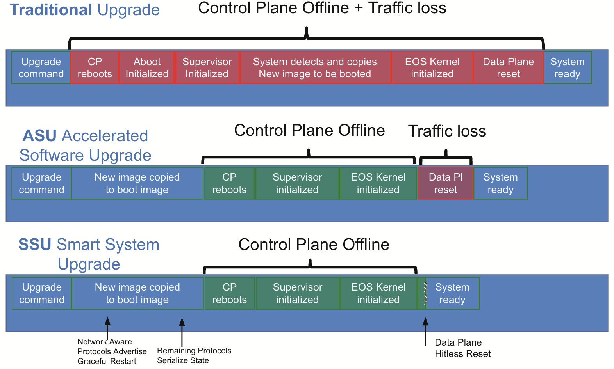
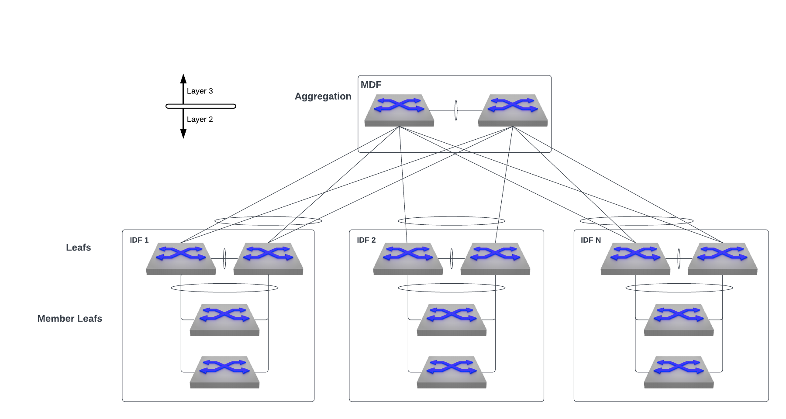
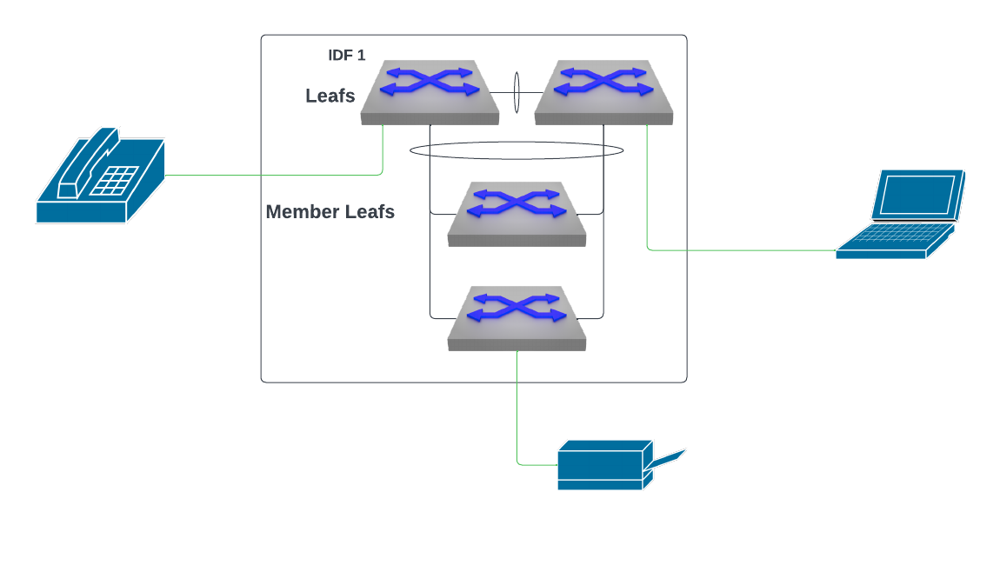
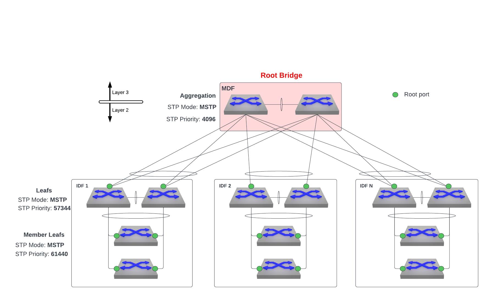
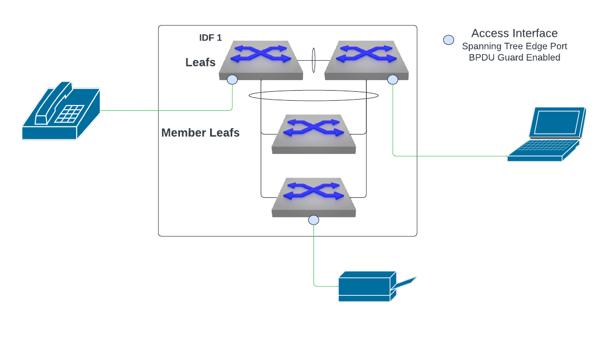

# Hitless Arista EOS Upgrades

## Introduction
In my time as a services engineer, I've come across too many organizations running end of support code in their network. When you ask them why, the answer you almost always get is "it's impossible for us to get a window of downtime to upgrade". In today's world, where applications are required to be up literally 24/7, finding a window for upgrades is almost always an arduous task. This predicament has burdened organizations with outdated networks made up of unsupported hardware running unsupported softwaare that is susceptible to who knows how many newly discovered security vulnerabilities. But fear not! Modern network designs and new advances in software upgrades have supplied the field with new types of arrows to seemlessly upgrade network infrastructure without having to worry about the typical downtime that comes along with it. Specifically, the introduction of MLAG ISSU (In-Service System Upgrade) and SSU (Smart System Upgrade) allows for hitless network upgrades where packet loss is minimized and there is no disruption to users on the network. These innovations allow organizations to confidently keep their networks up-to-date while maintaining availability and further enhancing reliabilty.

## Hitless Upgrade Mechanisms

### MLAG ISSU
 With MLAG (multi-chassis link aggregation), two physical switches are linked to form one logical switch which provides redundancy and resiliency. MLAG ISSU (In-Service System Upgrade) allows users to upgrade the switches that make up an MLAG pair in a hitless fashion so long as all connected endpoints are dual-homed to the MLAG pair. The upgrades to each MLAG peer are performed serially, where EOS software gets upgraded on one MLAG peer without a change in the network topology and with minimal traffic loss on active MLAG interfaces thanks to traffic flowing over to the other active MLAG peer. Once the upgrade of the first MLAG peer is complete and the MLAG pair is back in a healthy state, the second peer MLAG peer gets upgraded in the same manner.

### SSU
 Smart System Upgrade (SSU) provides the ability to upgrade an EOS image with minimal packet loss and without user disruption without needing to make a switch a member of an MLAG. Comparing SSU upgrades to traditional upgrades and even Accelerated System Upgrades, a smart system upgrade is the optimal upgrade method when optimizing for minimal traffic loss. (< 100 ms).



During a SSU the control plane of the switch does go offline.  However, the last known forwarding state for the switch is preserved through the upgrade and all forwarding decisions are based off of that state. This means that all devices that were connected to a switch prior to kicking off an SSU will operate as normal when the control plane goes offline. New addresses will not be learned while the control plane is offline though so new devices connecting to a switch undergoing SSU will not be able to connect to the network until the upgrade is complete.

#### Requirements
##### Platform Compatability
###### Supported
- DCS-7050SX, DCS-7050TX, DCS-7050QX
- DCS-7050SX3, DCS-7050CX3, DCS-7050TX3
- DCS-7260CX3
- DCS-7060X, DCS-7060X2
- DCS-7260QX
- CCS-720 (4.24.X)
- 7280TR-48C6 (4.22.0F)
- 7280SR-48C6 (4.22.1F)

###### Soon to be Supported
- CCS-720XP-96ZC2
- CCS-750XP
- DCS-7020

###### Not Supported
- CCS-710
- CCS-722XPM
- DCS-7010T, DCS-7010TX
- DCS-7050SX-72, DCS-7050SX-96, DCS-7050TX-72, DCS-7050TX-96
- DCS-7050QX2, DCS-7050SX2, DCS-7050TX2
- DCS-7260CX
- DCS-7300X, DCS-7320X, DCS-7300X3

##### Features NOT Supported
NOTE: SSU still may not be supported on a device if the device is running one of the protocols below.
- VRRP
- BFD
- PTP
- VXLAN routing

If that is in fact the case, another upgrade method like MLAG ISSU must be used.

##### Spanning Tree
It is very important to take spanning tree into consideration when architecting a network that will use hitless upgrades. In order to perform an SSU on Arista EOS, Spanning Tree Protocol (STP) must either be disabled or configured as MSTP. Assuming MSTP is configured, all non-fabric interfaces must be configured as edge ports with bpdu guard enabled. This is to ensure that a switch undergoing a hitless upgrade will not cause a spanning tree topology change which could lead to a brief period of network downtime. In addition to this, SSU of the root bridge in a spanning tree topology will not be hitless unless the root bridge is a member of an MLAG pair where all devices connecting to the MLAG pair are dual homed. This way, a user can upgrade one side of the MLAG pair while the other side maintains spanning-tree state for the spanning tree topology. If the root bridge is not a member of an MLAG pair, there will be a root bridge change when the control plane for the switch goes down which will lead to a period of packet loss and network disruption.

###### STP Restartable
In order to achieve a hitless upgrade, it is crucial that the STP agent on the switch being upgraded is in a restartable state. This is part of what ensures a successful MLAG failover.

STP agent restartability requires consistent configuration between the peers of STP, LACP, MLAG, and switchport parameters. Additionaly, events triggering an STP state machine change, such as a flapping ethernet interface, may also briefly prevent the STP agent from being restartable. 

> Note: If the STP agent is not restartable due to an STP state machine change, the resolution is to prevent any new state changes from occurring (by shutting down or fixing a flapping interface) and wait ~30 seconds for STP to become stable.

The restartable state of this agent can be seen by issuing the command `show spanning tree instance detail`
<pre>
switch#show spanning-tree instance detail
Stp Detailed Status:
   <b>Stp agent restartable         :         True</b>
   MST-PVST interoperation       :     Disabled

MST0
  Bridge ID  Priority    32768  (priority 32768 sys-id-ext 0)
             Address     2edd.e95d.1c89
             Hello Time  2.000 sec  Max Age 20 sec  Forward Delay 15 sec
</pre>

If the STP agent restartable value is False, spanning tree topology changes may occur when the switch undergoes a hitless upgrade which can result in traffic loss and a brief period of downtime.

This is especially relevant when the primary switch in an MLAG pair goes down while STP is in a non-restartable state. This is because in normal operation when STP is in a restartable state for two switches in MLAG, the primary switch in the MLAG pair controls the STP operations. In order for MLAG failover to occur gracefully, the secondary switch in the MLAG pair must be aware of the STP state controlled by the primary. When STP is **not** restartable, that indicates that the current known STP state is stale. So if a reload of the primary switch in the MLAG pair were to occur while STP is not restartable, the secondary switch would not have an existing known spanning tree state to work off of when it assumes control and would therefore need to relearn the spanning-tree topology from scratch leading to a period of reconvergence and downtime.

Starting in EOS 4.29.2F, if the STP agent is not in a restartable state, a warning message will appear when issuing the `show reload fast-boot` command or `reload fast-boot` command.
```
switch#show reload fast-boot
Warnings in the current configuration detected:
STP is not currently restartable
```
###### Non-Edge Ports
**Root/Alternate Role**
SSU is only supported with spanning-tree enabled when all non-edge ports are in either root or alternate roles.

The `show reload fast-boot` command will display a blocking reason if the non-edge ports are in a designated/backup role.

```
switch#show reload fast-boot
'reload fast-boot' cannot proceed due to the following:
One or more non-edge ports are in spanning-tree designated/backup role
```

**Bridge Assurance**
SSU is not supported with bridge assurance enabled on non-edge ports.

The `show reload fast-boot` command will display a blocking reason if the non-edge ports are in a designated/backup role.

```
switch#show reload fast-boot
'reload fast-boot' cannot proceed due to the following:
Transmit active is enabled for one or more ports
```

###### PVST+/PVRST+ and MSTP Interop
PVRST+ seems to be the spanning-tree mode most prevalent in networks today. This poses a bit of a challenge in the context of SSU since the only mode of spanning-tree that can be run with SSU is MSTP. The good news though, is that it is possible for MSTP to interoperate with PVST+/PVRST+. In an interop scenario, outgoing Common Internal Spanning Tree (CIST) BPDUs coming from switches running PVST+/PVRST+ are projected as Rapid PVST+ BPDUs across various VLANs. When they hit a border port on a switch running MSTP, the incoming PVST+ topology BPDU is mapped to corresponding MSTI based on the incoming VLAN. So dumbing this down a bit, what happens is PVST+ BPDUs on the native vlan (VLAN1) will be used to interop with the MSTP MST0 instance. Therefore, it is important to allow VLAN 1 on any trunk interfaces between switches running PVST+/PVRST+ and switches running MSTP. If the design allows for it, it is also possible to make a switch running MSTP interoperating with a switch running PVST+/PVRST+ a MST/PVST border switch by applying the command `spanning-tree mst pvst border` on the MSTP switch. This does come with some restrictions though. These restrictions, as seen below, are relevant only for border ports with roles ‘designated’ or ‘root’ (for CIST) that can potentially forward.
1. If the MSTP-Rapid PVST+ border port role is ‘designated’ (for CIST), then it should not receive any superior Rapid PVST+ BPDU (with respect to CIST). Root of all VLANs in the Rapid PVST+ region should be towards the MSTP region.
2. If the MSTP-Rapid PVST+ border port role is ‘root’ (for CIST), then it should not receive any inferior Rapid PVST+ BPDU (with respect to CIST). Root of all VLANs in the Rapid PVST+ region should be within the PVST+ region.

**Note**: If the restrictions are violated, the port enters ‘blocking’ state. The BPDU translation occurs only on MSTP-Rapid PVST+ border ports with the ‘forwarding’ state (for CIST). 

## Example Design
### Topology
Below is an example of a standard L2 campus topology.


The MDF switches are an MLAG pair serving as the aggregation switches for the layer 2 domain.  Downstream of this MDF are several IDFs where each IDF consists of two leafs in an MLAG pair with downstream member leafs. It is here we expect endhosts to connect to the network.


Therefore, our spanning tree topology for this campus fabric should look like the diagram below.


The aggregation switches serve as the root bridge in the spanning tree topology. Since we are using MLAG and port-channels between switches, there are no loops in the topology when it is in a stable state and all fabric interfaces are forwarding. Non-fabric interfaces only exist on the IDF switches and are assumed to be access interfaces for endpoints. They should be configured as spanning tree edge ports with BPDU guard enabled to prevent any rogue switches or bridges from connecting to the fabric which may cause spanning tree to reconverge and cause a network outage. An example configuration can be found below.
```
interface Ethernet1
   description access interface
   spanning-tree portfast
   spanning-tree bpduguard enable
!
```


### Upgrades
We'll use both hitless upgrade mechanisms to upgrade the switches at this site. We expect everything to be dual homed to the MDF switches in MLAG that are acting as the root bridge in the spanning tree topology. These switches are also our L3 gateway to the rest of the network and can be assumed to be running some routing protocols. For these reasons, it is best to upgrade these MDF switches using MLAG ISSU. At the IDF level, however, we expect connecting endpoint devices to be single homed. Therefore, we will be forced to use SSU if we do not want to interrupt users on the network.

#### Member Leafs
These switches are the simplest to upgrade. They will be upgraded using SSU. By nature of our design, all of these member switches can be upgraded in parallel since they are completely independent of each other. Before the upgrade, it is best to check for any errors or warnings in the configuration that may prevent a hitless upgrade by using the command `show reload fast-boot`. After verifying that there are no issues, all that needs to be done is to set the boot image to the new image, save the config, kick off the hitless upgrade using `reload fast-boot`, and then confirm.

```
switch#reload fast-boot
Running AsuPatchDb:doPatch( version=4.29.2F-30640700.4292F, model=Strata )
No warnings or unsupported configuration found.
2023-05-26 21:25:54.181672 Kernel Files /mnt/flash/EOS-4.29.2F.swi extracted from SWI
2023-05-26 21:25:56.523032 ProcOutput passed to Kernel ['crashkernel=512-4G:37M,4G-8G:41M,8G-:59M', 'nmi_watchdog=panic', 'tsc=reliable', 'pcie_ports=native', 'reboot=p', 'usb-storage.delay_use=0', 'pti=off', 'crash_kexec_post_notifiers', 'watchdog.stop_on_reboot=0', 'mds=off', 'nohz=off', 'CONSOLESPEED=9600', 'console=ttyS0', 'Aboot=Aboot-norcal6-6.1.7-13531819', 'block_flash=pci0000:00/0000:00:14.7/mmc_host/.*$', 'block_usb1=pci0000:00/0000:00:12.0/usb1/1-1/1-1.1/.*$', 'block_usb2=pci0000:00/0000:00:12.0/usb1/1-1/1-1.4/.*$', 'block_drive=pci0000:00/0000:00:11.0/.*host./target.:0:0/.*$', 'net_ma1=pci0000:00/0000:00:02.4/.*$', 'platform=island', 'sid=RoeIsland', 'log_buf_len=2M', 'systemd.show_status=0', 'systemd.default_standard_output=tty', 'hwaddr_ma1=fc:bd:67:0e:da:5e', 'sdhci.append_quirks2=0x40', 'amd_iommu=off', 'nvme_core.default_ps_max_latency_us=0', 'SWI=/mnt/flash/EOS-4.29.2F.swi', 'arista.asu_hitless']
Proceed with reload? [confirm]y
Proceeding with reload
```

> **Note:** If these switches are running a version of EOS prior to 4.29.2F, spanning tree will need to be disabled in order to perform SSU. This should be acceptable in our design since there are no loops from the member leafs to the upstream IDF MLAG leafs but it is important to check that all ports are forwarding before turning off spanning tree by issuing the command `show spanning-tree blockedports` and verifying that 0 ports are in a blocked state.

#### IDF MLAG Leafs
For each IDF, each switch in the MLAG pair should be upgraded in series using SSU. One important bit of configuration on these switches is the reload delay timers configured in MLAG.

<pre>
mlag configuration
   reload-delay mlag  <b>0</b>
   reload-delay non-mlag  <b>0</b>
</pre>

Since these switches are only layer 2 in our design, it won't be running any routing protocols so we do not need to set reload delay timers to give any time for routing protocols to restart and converge. Instead, we want all interfaces to jump immediately into an up state and begin forwarding traffic immediately.

Before kicking off the hitless upgrade, it is best to make sure STP is in a restartable state using the command `show spanning-tree instance detail` as mentioned earlier. This is an extra step just to be safe since we would also see a warning if we issued the `show reload fast-boot` or `reload fast-boot` command while the STP agent is not restartable.

One final check worth doing is making sure MLAG is in a healthy state. We can do so by looking at the outputs of the commands below.

<pre>
switch#show mlag config-sanity
<b>No global configuration inconsistencies found.</b>

<b>No per interface configuration inconsistencies found.</b>

switch#show mlag
MLAG Configuration:
domain-id                          :                MLAG
local-interface                    :            Vlan4094
peer-address                       :         169.254.0.1
peer-link                          :    Port-Channel2000
peer-config                        :          <b>consistent</b>

MLAG Status:
state                              :              <b>Active</b>
negotiation status                 :            <b>Connected</b>
peer-link status                   :                 <b>Up</b>
local-int status                   :                 <b>Up</b>
system-id                          :   96:8e:d3:b3:dd:01
dual-primary detection             :            Disabled
dual-primary interface errdisabled :               False

MLAG Ports:
Disabled                           :                   0
Configured                         :                   0
Inactive                           :                   0
Active-partial                     :                   0
Active-full                        :                   1
</pre>

After verifying that STP is restartable, the reload delay timers are set to 0, and MLAG is in a healthy state, we can go ahead and kick off the SSU on the first switch in the MLAG pair. Once the SSU completes for the first switch, the process can be repeated on the second switch in the MLAG pair.

#### MDF MLAG Aggregation Switches
This is the most important part of the upgrades as this MLAG pair is the root bridge in the STP topology as well as the L3 gateway for the network. All devices connected to these switches should be dual homed for redundancy purposes. This way, when one side of the MLAG pair reboots during the upgrade, the other side can take ownership of STP control plane operations and take on any data plane traffic which flows over.

So long as all devices connected to the Aggregation MLAG pair  (at layer 2 and layer 3) are connected to both switches, we can upgrade these switches using MLAG ISSU. Using MLAG ISSU will allow for any routing protocols being run to gracefully reconverge when the switch's control plane comes back online after the upgrade. If there are layer 2 devices which are single homed to these switches in MLAG, a completely hitless upgrade cannot be expected due to spanning-tree incompleteness and it is best to account for a period of downtime.

Unlike the IDF MLAG switches, the MDF MLAG switches should have non-zero reload delay values. By default, a switch will be configured with some platform specific reload delay timers. It should not be necessary to change these reload delay timers but if they are configured explicitly, it is important that the non-mlag reload delay be higher than the mlag reload delay timer.

<pre>
mlag configuration
   reload-delay mlag  <b>< lower-value ></b>
   reload-delay non-mlag  <b> < higher-value ></b>
</pre>

Like before, it is important to check the STP agent's restartability using `show spanning-tree instance detail` to ensure the STP root bridge doesn't change on reload and to make sure MLAG is in a healthy state with `show mlag config-sanity` and `show mlag`.

If the switch is running BGP, we can ensure L3 traffic isn't lost by putting the switch into BGP maintenance mode prior to upgrading. This is used to divert traffic away from the switch being upgraded, minimizing traffic impact.

**Pre Upgrade**
```
switch(config)#maintenance
switch(config-maintenance)#unit system
switch(config-builtin-unit-System)#quiesce
```

Once the upgrade is complete, we can take the switch out of BGP maintenance mode. 

**Post Upgrade**
```
switch(config)#no maintenance
```

After upgrading the first switch in this MLAG pair, it is important to wait for the reload timers to expire before upgrading the second switch in the MLAG pair. This is because all interfaces besides the MLAG interfaces on the switch which just reloaded will be in an 'errdisabled' state until the reload delay timers expire. Therefore, if you start the upgrade of the second switch in the MLAG before the reload delay timers expire, traffic will be lost.

<pre>
switch#show mlag
MLAG Configuration:
domain-id                          :                MLAG
local-interface                    :            Vlan4094
peer-address                       :         169.254.0.1
peer-link                          :    Port-Channel2000
peer-config                        :          consistent

MLAG Status:
state                               :      <b>Active/Reload (0:04:37 left)</b>
negotiation status                 :           Connected
peer-link status                   :                  Up
local-int status                   :                  Up
system-id                          :   96:8e:d3:b3:dd:01
dual-primary detection             :            Disabled
dual-primary interface errdisabled :               False

MLAG Ports:
Disabled                           :                   0
Configured                         :                   0
Inactive                           :                   0
Active-partial                     :                   1
Active-full                        :                   0

switch#show interfaces status
Port       Name                   Status       Vlan      Duplex Speed  Type         Flags Encapsulation
Et1                               errdisabled  1         auto   auto   1000BASE-T
Et2                               errdisabled  1         auto   auto   1000BASE-T
Et3                               errdisabled  1         auto   auto   1000BASE-T
...
Et45                              errdisabled  1         auto   auto   1000BASE-T
Et46                              errdisabled  1         auto   auto   1000BASE-T
Et47       MLAG peer link member  connected    in Po2000 a-full a-1G   1000BASE-T
Et48       MLAG peer link member  connected    in Po2000 a-full a-1G   1000BASE-T
Et49                              errdisabled  1         full   10G    10GBASE-CR
Et50                              errdisabled  1         full   10G    10GBASE-CR
...
Et53                              errdisabled  routed    full   10G    10GBASE-CR
Et54                              errdisabled  1         full   25G    Not Present
Ma1                               connected    routed    a-full a-1G   10/100/1000
Po2000     MLAG peer link         connected    trunk     full   2G     N/A
</pre>

In the event that there is no layer 3 redundancy with the MDF MLAG pair, but all connected layer 2 devices are dual homed, it is possible to achieve a hitless upgrade by using SSU with Graceful Restart enabled. Some additional configuration is required though.

Remember, during an SSU, the control plane does go down. However, by configuring Graceful Restart (GR) we can give the switch the ability to preserve its L3 forwarding state even while the control plane is down, allowing traffic to flow based on existing prefixes present in hardware. This is also known as non-stop forwarding. This aids upgrades and restarts to minimize L3 traffic loss.

This can be configured for a switch running either BGP or OSPF.

With BGP Graceful Restart ([RFC 4724](https://www.rfc-editor.org/rfc/rfc4724)), traffic is forwarded based on existing prefixes and the switch notifies its BGP neighbors of this ability.  Once BGP has recovered, routing updates are sent to BGP neighbors to clear any stale entries.  

```
switch(config-router-bgp)# graceful-restart
switch(config-router-bgp)# graceful-restart grace-period 600
```

With OSPF Graceful Restart ([RFC3623](https://www.rfc-editor.org/rfc/rfc3623)), an OSPF router stays on the forwarding path even as the OSPF software restarts.

```
switch(config-router-ospf)# graceful-restart
switch(config-router-ospf)# graceful-restart grace-period 600
```

Again, forwarding decisions are made based on the state of the forwarding table just prior to the device's control plane going offline. So if there are any changes/updates received from L3 peers while the control plane is down, those updates will not make their way into the down device's forwarding table and traffic loss may occur. Also keep in mind that there are a number of caveats and limitations running SSU. So it is always recommended to have redundancy at this layer so you can upgrade more reliably using MLAG ISSU. If you choose to upgrade L3 devices using SSU, just be aware that there is a greater risk of network impact.

### Summary
There are so many new technologies that make upgrades easy and non-impactful. In this article, we discussed integrating these different mechanisms into different upgrade procedures using just the CLI. But these recipes can easily be automated with vendor specific or open source tools which allow for an even simpler upgrade experience. Considering this along with everything else we've discussed, upgrades should no longer be this scary thing everyone tries to avoid doing. While upgrades may have caused more trouble than good in the past, they should wind up saving you from trouble that comes from not upgrading going forward.

### References
https://www.arista.com/en/um-eos/eos-multi-chassis-link-aggregation
https://www.arista.com/en/um-eos/eos-smart-system-upgrade
https://arista.my.site.com/AristaCommunity/s/article/Hitless-Upgrades-The-Whats-The-Whys-and-The-Hows
https://arista.my.site.com/AristaCommunity/s/article/mlag-issu
https://www.arista.com/en/um-eos/eos-spanning-tree-protocol
https://www.arista.com/en/support/toi/eos-4-29-2f/17200-support-for-mstp-ssu-with-network-ports
https://arista.my.site.com/AristaCommunity/s/question/0D52I00007ERqE2SAL/mlag-reloaddelay